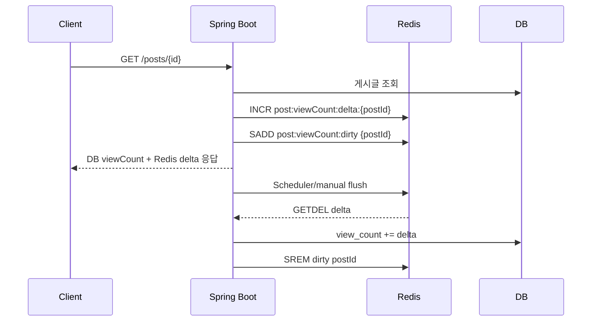

# Redis 기반 게시판 조회수 개선 프로젝트

Spring Boot 기반 게시판 CRUD 프로젝트에 Redis 기반 조회수 buffering 구조를 적용한 프로젝트입니다.

게시글 조회 시마다 DB에 조회수를 직접 update하면 트래픽 증가 시 DB write 부하가 커질 수 있습니다.  
이를 개선하기 위해 Redis에 조회수 증가분을 먼저 누적하고, Scheduler 또는 manual flush를 통해 주기적으로 DB에 반영하는 구조를 적용했습니다.

조회수는 결제/재고처럼 강한 정합성이 필요한 데이터가 아니므로, 약간의 지연 반영을 허용하는 eventual consistency 방식으로 설계했습니다.

---

## 핵심 성과

- 게시글 조회 시 발생하는 DB direct update 구조를 Redis buffering 구조로 개선
- 1000회 조회 기준 DB write 횟수를 `1000회 → 1회`로 감소
- Redis delta key와 dirty set을 활용해 변경된 게시글만 DB에 batch 반영
- Scheduler/manual flush를 통해 Redis 누적 조회수를 DB에 반영
- Redis `GETDEL` 기반으로 flush 중 새로 증가한 조회수 유실 가능성 완화
- DB 반영 실패 시 Redis delta를 복구하여 데이터 유실 가능성 감소
- 통합 테스트로 조회수 증가, DB 반영, Redis key 정리 흐름 검증

---

## 기술 스택

- Java 17
- Spring Boot
- Spring Web
- Spring Data JPA
- Spring Data Redis
- Validation
- H2 Database
- Redis
- Docker
- Gradle
- JUnit 5 / AssertJ

---

## 주요 기능

- 게시글 생성 / 조회 / 수정 / 삭제
- 게시글 목록 페이징
- Validation 적용
- Global Exception Handling
- BaseTimeEntity 기반 생성일/수정일 관리
- Redis 기반 조회수 증가
- Dirty Set 기반 flush 대상 관리
- Scheduler/manual flush를 통한 DB 반영
- DB direct update 방식과 Redis buffering 방식 비교
- flush 실패 시 Redis delta 복구
- Redis 조회수 처리 흐름 통합 테스트

---

## API 목록

| Method | URI | 설명 |
|---|---|---|
| POST | `/posts` | 게시글 생성 |
| GET | `/posts` | 게시글 목록 페이징 조회 |
| GET | `/posts/{id}` | 게시글 단건 조회 + Redis 조회수 증가 |
| PUT | `/posts/{id}` | 게시글 수정 |
| DELETE | `/posts/{id}` | 게시글 삭제 |
| POST | `/posts/{postId}/view-count/flush` | 특정 게시글 Redis 조회수 manual flush |
| PATCH | `/posts/{id}/view/db` | DB 직접 조회수 증가 비교용 |
| POST | `/posts/test/db?count=1000` | DB direct update 성능 비교 테스트 |
| POST | `/posts/test/redis?count=1000` | Redis buffering 성능 비교 테스트 |

---

## 조회수 처리 구조

```text
게시글 조회 요청
→ DB에서 게시글 조회
→ Redis delta +1
→ dirty set에 postId 등록
→ 응답 viewCount = DB viewCount + Redis delta
→ Scheduler/manual flush
→ DB viewCount += Redis delta
→ Redis delta key 삭제
→ dirty set 제거
```

---

## Architecture



---

## Redis Key 설계

### 조회수 delta key

```text
post:viewCount:delta:{postId}
```

게시글별 조회수 증가분을 저장합니다.

예시:

```text
post:viewCount:delta:1 = 15
```

---

### Dirty Set

```text
post:viewCount:dirty
```

조회수가 증가한 게시글 ID를 Set으로 관리합니다.  
전체 Redis key를 scan하지 않고, 변경된 게시글만 flush 대상으로 처리하기 위해 사용했습니다.

예시:

```text
post:viewCount:dirty = [1, 3, 7]
```

---

## 주요 구현

### 1. Redis 조회수 증가

```java
public void increase(Long postId) {
    redisTemplate.opsForValue().increment(deltaKey(postId));
    addDirtyPostId(postId);
}
```

게시글 조회 요청 시 DB를 직접 update하지 않고 Redis delta만 증가시킵니다.  
동시에 dirty set에 postId를 등록해 이후 flush 대상이 되도록 합니다.

---

### 2. Scheduler Batch Flush

```java
@Scheduled(fixedDelay = 60000)
public void flushViewCounts() {
    Set<String> dirtyPostIds = viewCountService.getDirtyPostIds();

    if (dirtyPostIds == null || dirtyPostIds.isEmpty()) {
        log.info("[ViewCountFlushScheduler] flush 대상 없음");
        return;
    }

    log.info("[ViewCountFlushScheduler] flush 시작 - 대상 수={}", dirtyPostIds.size());

    for (String postId : dirtyPostIds) {
        try {
            postService.flushViewCountToDb(Long.parseLong(postId));
            log.debug("[ViewCountFlushScheduler] flush 성공 - postId={}", postId);
        } catch (Exception e) {
            log.error("[ViewCountFlushScheduler] flush 실패 - postId={}", postId, e);
        }
    }

    log.info("[ViewCountFlushScheduler] flush 종료 - 처리 수={}", dirtyPostIds.size());
}
```

`fixedDelay`를 사용하여 이전 flush 작업이 끝난 뒤 60초 후 다음 작업이 실행되도록 했습니다.  
flush 작업 시간이 길어질 경우에도 작업이 중첩 실행되지 않도록 하기 위한 선택입니다.

---

### 3. DB 반영 및 실패 복구

```java
@Transactional
public void flushViewCountToDb(Long postId) {
    Long redisCount = viewCountService.getAndDeleteDelta(postId);

    if (redisCount == null || redisCount <= 0L) {
        viewCountService.removeDirtyPostId(postId);
        return;
    }

    try {
        postRepository.increaseViewCountBy(postId, redisCount);
        viewCountService.removeDirtyPostId(postId);
    } catch (Exception e) {
        viewCountService.increaseBy(postId, redisCount);
        throw e;
    }
}
```

DB 반영에 실패하면 이미 가져온 Redis delta 값을 다시 Redis에 복구합니다.  
이를 통해 flush 중 예외가 발생해도 조회수 증가분이 유실될 가능성을 줄였습니다.

---

## Flush 안정성

단순히 아래 순서로 처리하면 동시 요청 상황에서 조회수 유실 가능성이 있습니다.

```text
GET delta
→ DB UPDATE
→ DELETE delta
```

예를 들어 `GET` 이후 새로운 조회 요청이 들어와 Redis delta가 증가했는데, 이후 `DELETE`가 실행되면 새로 증가한 값까지 함께 삭제될 수 있습니다.

이를 완화하기 위해 Redis의 `GETDEL` 방식으로 delta를 가져오면서 삭제합니다.

```text
Redis GETDEL delta
→ DB view_count += delta
→ dirty set 제거
→ 실패 시 Redis delta 복구
```

이 구조는 완전한 분산 트랜잭션은 아니지만, 조회수처럼 약한 정합성을 허용할 수 있는 데이터에서는 현실적인 trade-off로 판단했습니다.

---

## DB Direct Update 방식과 비교

비교를 위해 DB에 직접 조회수를 증가시키는 API도 구현했습니다.

```java
@Modifying
@Query("update Post p set p.viewCount = p.viewCount + 1 where p.id = :id")
int directIncreaseViewCount(@Param("id") Long id);
```

### 처리 방식 비교

| 방식 | 요청 수 | DB Write 횟수 | 특징 |
|---|---:|---:|---|
| DB Direct Update | 1000회 | 1000회 | 요청마다 DB update |
| Redis + Batch Flush | 1000회 | 1회 | Redis 누적 후 batch 반영 |

핵심 차이는 단건 처리 속도가 아니라 DB write 횟수 감소입니다.

---

## 성능 비교 결과

테스트 환경:

- 로컬 개발 환경
- 단일 스레드 반복 호출
- 요청 수: 1000회
- DB Direct Update와 Redis Buffering 방식 비교

| 방식 | 요청 수 | Total Time | DB Write 횟수 | 특징 |
|---|---:|---:|---:|---|
| DB Direct Update | 1000회 | 325 ms | 1000회 | 요청마다 DB update |
| Redis + Batch Flush | 1000회 | 719 ms | 1회 | Redis 누적 후 batch 반영 |

로컬 단일 스레드 환경에서는 Redis 방식의 total time이 DB direct update보다 더 크게 측정되었습니다.

이는 Redis `increment`, dirty set 추가, network round-trip 비용이 포함되기 때문입니다.  
따라서 이 결과는 Redis가 단건 처리에서 항상 빠르다는 의미가 아니라, Redis 기반 구조가 DB write 횟수를 줄이는 데 목적이 있음을 보여줍니다.

---

## 실험 한계

이번 성능 비교는 로컬 개발 환경의 단일 스레드 반복 호출 방식으로 수행했습니다.

따라서 실제 운영 환경에서 발생할 수 있는 다음 요소들은 완전히 반영하지 못했습니다.

- 다중 사용자 동시 요청
- DB connection pool 경합
- DB row lock 대기
- Redis network latency
- 애플리케이션 서버와 DB/Redis 간 분리된 네트워크 환경
- Scheduler 실행 주기에 따른 DB 반영 지연

따라서 본 실험은 "Redis 방식이 항상 더 빠르다"를 증명하기 위한 것이 아닙니다.

이 실험의 목적은 조회수 증가 요청에서 DB 직접 update 방식과 Redis buffering 방식을 비교하고, Redis 기반 구조가 DB write 횟수를 줄이는 효과가 있음을 확인하는 것입니다.

---

## 테스트 시나리오

1. 게시글 조회 요청을 여러 번 호출
2. Redis delta 값과 dirty set 확인
3. Scheduler/manual flush 실행
4. DB viewCount 증가 확인
5. Redis delta key 삭제 확인
6. dirty set에서 postId 제거 확인
7. DB 반영 실패 시 Redis delta 복구 확인

Redis CLI 확인:

```bash
docker exec -it board-redis redis-cli
```

```redis
GET post:viewCount:delta:1
SMEMBERS post:viewCount:dirty
```

---

## 테스트 검증

Redis 기반 조회수 처리 흐름을 통합 테스트로 검증했습니다.

테스트 간 Redis 데이터 오염을 방지하기 위해 각 테스트 실행 전후로 조회수 delta key와 dirty set을 초기화했습니다.

### 1. 조회 시 Redis delta 증가 검증

게시글 조회 요청 시 DB의 `view_count`를 직접 증가시키지 않고 Redis delta만 증가하는지 검증했습니다.

검증 항목:

- 게시글 조회 요청 횟수만큼 Redis delta 증가
- dirty set에 postId 등록
- flush 전까지 DB `view_count`는 변경되지 않음

---

### 2. flush 시 DB 반영 및 Redis 정리 검증

Redis에 누적된 조회수 delta를 DB에 반영한 뒤 Redis key와 dirty set이 정리되는지 검증했습니다.

검증 항목:

- Redis delta 값만큼 DB `view_count` 증가
- Redis delta key 삭제
- dirty set에서 postId 제거

---

## 테스트 실행

전체 테스트 실행:

```bash
./gradlew test
```

Windows CMD 환경:

```cmd
gradlew.bat test
```

Windows PowerShell 환경:

```powershell
.\gradlew.bat test
```

특정 통합 테스트만 실행:

```bash
./gradlew test --tests "com.example.board.PostViewCountIntegrationTest"
```

Windows CMD 환경:

```cmd
gradlew.bat test --tests "com.example.board.PostViewCountIntegrationTest"
```

Windows PowerShell 환경:

```powershell
.\gradlew.bat test --tests "com.example.board.PostViewCountIntegrationTest"
```

---

## 설계 Trade-off

### 장점

- 조회 요청마다 DB write를 수행하지 않음
- DB write 횟수 감소
- dirty set을 통해 변경된 게시글만 flush
- batch flush를 통한 write aggregation
- flush 실패 시 Redis delta 복구 가능
- 조회 응답에는 `DB viewCount + Redis delta`를 사용해 사용자에게 최신에 가까운 조회수 제공 가능

### 단점

- DB 조회수 반영이 지연됨
- Redis와 DB 간 일시적인 데이터 차이 발생
- Redis 장애 상황에 대한 추가 대응 필요
- 단건 요청 기준으로는 Redis가 더 느릴 수 있음
- Redis와 DB를 함께 다루기 때문에 운영 복잡도가 증가함

---

## 면접 답변 포인트

### Redis를 사용한 이유

조회수는 요청마다 DB update를 수행하면 write 부하가 커지고, 동일 게시글에 트래픽이 몰릴 경우 row update 경합이 발생할 수 있습니다.  
조회수는 강한 정합성이 필수인 데이터가 아니므로 Redis에 증가분을 먼저 누적하고, 일정 주기마다 DB에 batch 반영하는 구조로 설계했습니다.

---

### Dirty Set을 사용한 이유

Redis 전체 key를 scan하면 운영 환경에서 성능 부담이 커질 수 있습니다.  
따라서 조회수가 증가한 게시글 ID만 dirty set에 저장하고, flush 시 dirty set에 포함된 게시글만 대상으로 처리했습니다.

---

### Redis 방식이 더 느리게 측정된 이유

로컬 단일 스레드 테스트에서는 Redis `increment`, dirty set 추가, network round-trip 비용 때문에 DB direct update보다 total time이 더 크게 측정될 수 있습니다.  
하지만 이 구조의 목적은 단건 요청 속도 개선이 아니라 DB write 횟수 감소와 트래픽 증가 상황에서의 DB 부하 완화입니다.

---

### 데이터 유실 가능성은 어떻게 줄였는가

flush 시 Redis delta를 `GETDEL`로 가져오면서 삭제하고, DB 반영에 실패하면 가져온 delta 값을 다시 Redis에 복구하도록 구현했습니다.  
이를 통해 flush 중 예외가 발생해도 조회수 증가분이 사라질 가능성을 줄였습니다.

---

## 결론

Redis delta, dirty set, Scheduler batch flush를 활용하여 조회수 증가 요청에서 발생하는 DB write 부하를 줄이는 구조를 적용했습니다.

조회수처럼 강한 정합성이 필요하지 않은 데이터에 대해 eventual consistency를 허용하고, batch flush와 실패 복구 로직을 통해 확장성과 안정성을 고려한 설계를 경험했습니다.

또한 통합 테스트를 통해 조회 시 Redis delta 증가, flush 시 DB 반영, Redis key 및 dirty set 정리 흐름을 검증했습니다.
